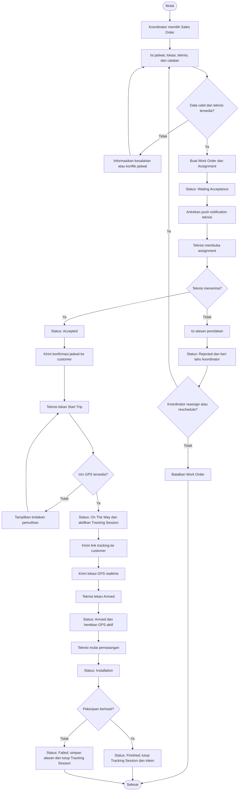
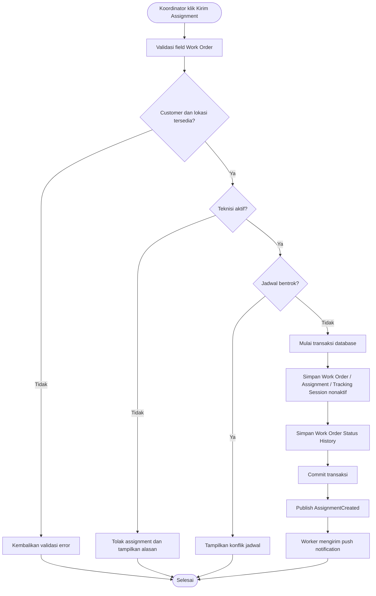
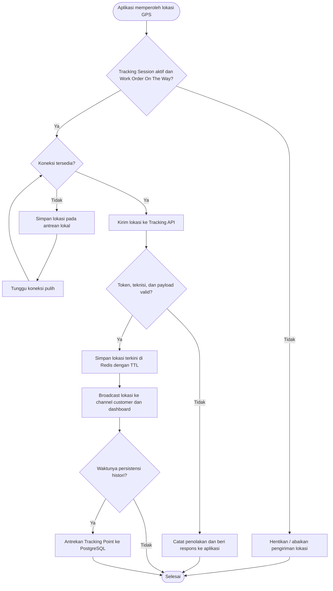

# Activity Diagram

## Field Service Management (FSM) v1.0 — Live Tracking & Job Dispatch

**Versi:** 1.0 (draft)  
**Dasar:** Use Case, Functional Requirements, dan System Flow FSM v1.0

---

## 1. Alur Utama: Assignment sampai Selesai

## 2. Activity: Validasi dan Pengiriman Assignment

## 3. Activity: GPS Update dan Realtime Tracking

## 4. Aturan Keputusan Utama

| Keputusan | Hasil jika tidak terpenuhi |
|---|---|
| Data Work Order lengkap | Assignment tidak dibuat; koordinator memperbaiki data. |
| Teknisi aktif dan tidak bentrok | Koordinator memilih teknisi/jadwal lain. |
| Teknisi menerima assignment | Koordinator melakukan reassignment, reschedule, atau pembatalan. |
| Izin GPS tersedia | Perjalanan tidak boleh ditandai aktif sampai kondisi dipulihkan. |
| Sesi tracking valid | Lokasi tidak diterima/ditayangkan. |
| Pekerjaan berhasil | Work Order menjadi `Finished`; bila tidak, menjadi `Failed` dengan alasan. |

## 5. Batasan dan Tindak Lanjut

- Pembatalan dapat terjadi dari status non-terminal sesuai otorisasi; proses ini akan dirinci pada Sequence Diagram dan state transition service.
- Strategi retry GPS, batas antrean offline, serta definisi konflik jadwal akan ditetapkan pada API Design dan desain teknis.
- Diagram berikutnya yang diperlukan adalah Sequence Diagram agar interaksi Vue, mobile, Laravel, Redis, PostgreSQL, queue, Reverb, dan provider notifikasi terlihat berurutan.

