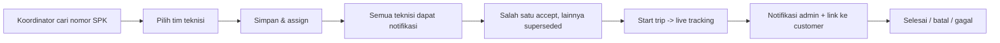

# Field Service Management (FSM) — fsmiml

Platform **Field Service Management** untuk manajemen pemasangan kaca film:
SPK dari sistem penjualan, penugasan tim teknisi, live tracking GPS, notifikasi,
dan portal tracking untuk customer.

> **Status:** Backend + integrasi data penjualan + dashboard admin trial sudah
> berjalan. Frontend Vue dan aplikasi mobile Capacitor menyusul sesuai roadmap.

## Alur Utama



## Fitur Utama

- **Autentikasi peran** — administrator, coordinator, technician (Laravel Sanctum).
- **Work Order dari SPK** — pencarian lintas database (sistem penjualan lama,
  read-only) dengan auto-suggest; saat simpan, data disalin ke PostgreSQL FSM.
- **Assignment multi-teknisi** — satu Work Order bisa ditugaskan ke banyak
  teknisi; yang pertama `accept` yang menang, penugasan lainnya otomatis
  `superseded` beserta notifikasi ke rekan tim.
- **State machine Work Order** —
  `draft → waiting_acceptance → accepted → on_the_way → arrived → installation → finished`,
  plus `rejected`, `cancelled`, `failed`; semua transisi divalidasi backend dan
  tercatat di riwayat.
- **Live tracking GPS** — lokasi terkini di Redis (TTL), histori di PostgreSQL
  via queue, dan broadcast realtime lewat Reverb (private channel per work order).
- **Tracking link customer** — token aman (hanya hash disimpan), masa berlaku,
  dan auto-revoke saat trip selesai/dibatalkan.
- **Notifikasi** — push FCM, WhatsApp (Fonnte / Wablas / Meta Cloud API), email,
  plus driver `log` untuk development.
- **Dashboard admin trial** — cari SPK, pilih teknisi, simpan, dan pantau daftar
  Work Order (Blade, responsif untuk mobile browser).

## Arsitektur

- **Modular monolith** — domain dipisah di `app/Modules` (Identity, Customer,
  Sales, WorkOrder, Assignment, Tracking, Notification, Legacy).
- **Service layer** — state machine, assignment, tracking token, delivery
  notifikasi; controller tetap tipis.
- **Event + Queue** — efek samping (notifikasi, audit, realtime) berjalan
  asinkron via Redis; event domain dipancarkan setelah transaksi sukses.
- **Satu API, banyak client** — `/api/v1` melayani web admin, mobile, dan
  portal customer dengan payload JSON via API Resource.

## Tech Stack

| Lapisan | Teknologi |
|---|---|
| Backend | Laravel 12, PHP 8.3 |
| Database | PostgreSQL (FSM) + koneksi read-only ke database sales lama |
| Cache / Queue / Realtime | Redis, Laravel Reverb (WebSocket) |
| Auth API | Laravel Sanctum |
| Web Admin (trial) | Blade (server-rendered, responsif) |
| Roadmap | Vue 3 + Vite (admin), Capacitor (mobile), deployment VPS |

## Quickstart Lokal

Persyaratan: PHP 8.2+, Composer, PostgreSQL, Redis (untuk queue/realtime).

```bash
composer install
cp .env.example .env        # isi DB_*, DB_OLD_*, FCM_*, WHATSAPP_*, dll
php artisan key:generate
php artisan migrate
php artisan fsm:create-user "Nama Koordinator" koordinator@example.com "password" --role=coordinator
```

Jalankan layanan pendukung (Redis, queue worker, Reverb), lalu akses
`http://localhost:8000` atau virtual host Laragon:

```bash
php artisan queue:work redis --queue=notifications,default,tracking --tries=3
php artisan reverb:start
php artisan serve
```

Login koordinator di `/login`, lalu mulai dari cari SPK di `/dashboard`.

## Web Admin Dashboard

- `/login` — session login (khusus administrator/coordinator)
- `/dashboard` — cari SPK (AJAX ke database sales), pilih banyak teknisi,
  atur tanggal pemasangan, simpan & assign
- `/dashboard/work-orders/{id}` — detail tim, item, riwayat status
- Daftar Work Order difilter default ke status **Menunggu Konfirmasi** agar
  cepat; ada dropdown untuk status lain / semua.

## API Ringkasan (`/api/v1`)

| Grup | Endpoint |
|---|---|
| Auth | `POST auth/login`, `GET auth/me`, `DELETE auth/logout` |
| Work Order | `GET/POST work-orders`, `GET work-orders/{id}`, `POST .../start-trip`, `arrive`, `start-installation`, `finish`, `cancel`, `fail` |
| Assignment | `POST work-orders/{id}/assignments` (multi-teknisi), `POST assignments/{id}/accept\|reject` |
| Tracking | `POST tracking-sessions/{id}/locations`, `POST .../tokens`, `GET public/tracking/{token}` |
| Legacy | `GET legacy/technicians`, `GET legacy/sales`, `POST legacy/work-orders` |
| Device | `POST device-tokens` |

## Notifikasi

Audit notifikasi dibuat dengan status `queued`, diproses queue `notifications`,
dan diperbarui menjadi `sent`/`failed`.

| Channel | Driver | Env |
|---|---|---|
| Push | `log` (dev) / `fcm` | `FCM_DRIVER`, `FCM_PROJECT_ID`, `FCM_CREDENTIALS` |
| WhatsApp | `log` / `fonnte` / `wablas` / `meta` | `WHATSAPP_DRIVER`, `FONNTE_TOKEN`, `WABLAS_*`, `META_WHATSAPP_*` |
| Email | Laravel Mail | `MAIL_MAILER`, `MAIL_FROM_*` |

## Integrasi Database Sales (Legacy)

- Koneksi **read-only** `sales` dikonfigurasi lewat `DB_OLD_*` di `.env`.
- `GET legacy/sales?search=` mencari `spk_no`; `GET legacy/technicians` untuk
  daftar teknisi.
- `POST legacy/work-orders` menyalin data ke PostgreSQL FSM dalam satu
  transaksi: customer (dedupe `external_id`), lokasi, sales order (snapshot
  `source_payload`), Work Order (nomor = `spk_no`), item, lalu import teknisi
  (dedupe `external_serial`) dan assign tim.

## Roadmap

1. Frontend Vue 3 admin (dashboard produksi, realtime map)
2. Mobile Capacitor (background GPS, push notification, offline sync)
3. Deployment VPS (Nginx, HTTPS, supervisor untuk queue/reverb, backup, monitoring)
4. Fitur lanjutan: checklist & foto pemasangan, tanda tangan digital, KPI
   teknisi, geofencing, ETA otomatis

## Lisensi

MIT
