# Field Service Management (FSM) — fsmiml

Platform **Field Service Management** untuk manajemen pemasangan kaca film milik **PT Indomotor Lestari**:
SPK dari sistem penjualan, penugasan tim teknisi, live tracking GPS, absensi berbasis lokasi, notifikasi,
dan portal tracking untuk customer.

> **Status (Agustus 2026):** Production — Backend, dashboard admin, dan aplikasi mobile sudah berjalan live di VPS.

---

## Alur Utama

```mermaid
flowchart LR
    A[Koordinator cari nomor SPK] --> B[Pilih tim teknisi]
    B --> C[Simpan & assign]
    C --> D[Semua teknisi dapat notifikasi]
    D --> E[Salah satu accept, lainnya superseded]
    E --> F[Absen Datang via mobile]
    F --> G[Start trip → live tracking GPS]
    G --> H[Notifikasi admin + link tracking ke customer]
    H --> I[Tiba → Instalasi → Selesai]
    I --> J[Absen Pulang via mobile]
```



---

## Fitur Utama

### Backend & Admin
- **Autentikasi peran** — `administrator`, `coordinator`, `technician` (Laravel Sanctum + PIN mobile).
- **Work Order dari SPK** — pencarian lintas database (sistem penjualan lama, read-only) dengan auto-suggest; data disalin ke PostgreSQL FSM.
- **Assignment multi-teknisi** — satu WO bisa ditugaskan ke banyak teknisi; yang pertama `accept` yang menang, penugasan lain otomatis `superseded`.
- **State machine Work Order** — `draft → waiting_acceptance → accepted → on_the_way → arrived → installation → finished`, plus `rejected`, `cancelled`, `failed`; semua transisi tervalidasi dan tercatat di riwayat.
- **Live tracking GPS** — lokasi terkini di Redis (TTL), histori di PostgreSQL via queue, broadcast realtime lewat Reverb.
- **Tracking link customer** — token aman (hanya hash disimpan), masa berlaku, dan auto-revoke saat trip selesai.
- **Notifikasi** — push FCM, WhatsApp (GoWA self-hosted), email.
- **Dashboard admin** — manajemen WO, absensi, laporan, live tracking Leaflet map.

### Mobile App (Capacitor Android)
- **Absensi dengan foto & GPS** — Absen Datang & Pulang dilengkapi foto kamera dan koordinat lokasi tervalidasi.
- **Kalender & Laporan Harian** — teknisi dapat melihat riwayat kehadiran per hari dengan tampilan kalender bulanan.
- **Pengajuan Cuti & Izin** — form pengajuan langsung dari mobile, dengan persetujuan koordinator di dashboard admin.
- **Anti Fake GPS** — deteksi *mock location* via native Android plugin (`MockLocationPlugin`):
  - Absensi: **blokir total** + warning merah jika Fake GPS aktif.
  - Live Tracking: dapat dikonfigurasi per teknisi dari admin (`allow_fake_gps`); jika diizinkan, tracking tetap jalan namun titik lokasi ditandai `is_mocked = true` di database.
- **Background GPS Tracking** — tracking berjalan walau aplikasi di-minimize (via foreground service).
- **Live Update OTA** — pembaruan kode Vue/JS tanpa install ulang APK (self-hosted via Capgo protocol).
- **Native APK Update** — notifikasi banner + auto-download APK baru dengan konfirmasi install user.
- **Bonus Tab** — rekap komisi/bonus teknisi per periode.

---

## Arsitektur

- **Modular monolith** — domain dipisah di `app/Modules/`: `Identity`, `Customer`, `Sales`, `WorkOrder`, `Assignment`, `Tracking`, `Attendance`, `Notification`, `Legacy`.
- **Service layer** — state machine, assignment, tracking token, notifikasi; controller tetap tipis.
- **Event + Queue** — efek samping (notifikasi, persistensi tracking, audit) berjalan async via Redis queue.
- **Satu API, banyak client** — `/api/v1` melayani web admin Blade, mobile Capacitor, dan portal customer.

---

## Tech Stack

| Lapisan | Teknologi |
|---|---|
| Backend | Laravel 12, PHP 8.3 |
| Database | PostgreSQL (FSM) + koneksi read-only ke DB sales lama |
| Cache / Queue / Realtime | Redis, Laravel Reverb (WebSocket) |
| Auth API | Laravel Sanctum |
| Web Admin | Blade (server-rendered, responsif) |
| Mobile | Vue 3 + Vite + Capacitor (Android APK) |
| Native Plugin | `MockLocationPlugin` (Java — deteksi Fake GPS) |
| GPS | `@capacitor/geolocation` + `@capacitor-community/background-geolocation` |
| Live Update | Capgo self-hosted (`@capgo/capacitor-updater`) |
| Map | Leaflet.js |
| Notifikasi WA | GoWA (self-hosted WhatsApp Gateway) |
| Signing APK | RSA 2048-bit keystore (`fsm-iml-release.keystore`) |

---

## Quickstart Lokal

**Persyaratan:** PHP 8.3+, Composer, PostgreSQL, Redis, Node.js 20+.

```bash
composer install
cp .env.example .env        # isi DB_*, DB_OLD_*, REVERB_*, WHATSAPP_*, dst
php artisan key:generate
php artisan migrate
php artisan fsm:create-user "Nama Admin" admin@example.com "password" --role=administrator
```

Jalankan layanan pendukung:

```bash
php artisan queue:work redis --queue=notifications,default,tracking --tries=3
php artisan reverb:start
php artisan serve
```

Login di `/login`, mulai dari cari SPK di `/dashboard`.

---

## Mobile App (Development)

```bash
cd mobile
npm install
npm run dev           # browser dev mode
npm run build         # build production bundle
npx cap sync android  # sync ke Android
```

### Rilis OTA Bundle (update Vue/JS tanpa install ulang APK)

```powershell
# Di root project
.\release-ota.ps1
# Upload bundles/{versi}.zip ke VPS, update MOBILE_BUNDLE_VERSION di .env VPS
```

### Rilis APK Native (update Java/plugin/permission)

```powershell
# Di root project — otomatis: bump versi, build, sign, rename, git push
.\release-native.ps1

# Opsi:
.\release-native.ps1 -Bump minor      # versi minor naik (1.x.0)
.\release-native.ps1 -Bump major      # versi major naik (x.0.0)
.\release-native.ps1 -Version 2.0.0   # paksa versi tertentu
.\release-native.ps1 -SkipBuild -SkipGradle  # skip build, hanya update file & git push
```

Script `release-native.ps1` secara otomatis:
1. Membaca versi dari `.env.liveserver.example`
2. Menaikkan versi (patch/minor/major)
3. Update `versionCode` & `versionName` di `android/app/build.gradle`
4. Update `version` di `mobile/package.json`
5. `npm run build` + `cap sync android`
6. `gradlew assembleRelease` (signed dengan `fsm-iml-release.keystore`)
7. Copy & rename APK → `apk-output/fsm-teknisi-{versi}.apk` + `public/downloads/apk/`
8. Update `MOBILE_APP_VERSION` & `MOBILE_APP_DOWNLOAD_URL` di `.env.liveserver.example`
9. `git add . → git commit → git push origin main`

> ⚠️ **Keystore wajib backup!** File `mobile/android/app/fsm-iml-release.keystore` tidak boleh hilang dan tidak boleh di-commit ke git.

---

## Deployment VPS

Setelah `git push` dari lokal (otomatis via script), di VPS:

```bash
git pull origin main

# Update .env VPS sesuai .env.liveserver.example
# (terutama MOBILE_APP_VERSION, MOBILE_APP_DOWNLOAD_URL, MOBILE_BUNDLE_VERSION)
php artisan config:clear
php artisan migrate

# Upload APK ke:
# /www/wwwroot/fsm.indomotorlestari.com/public/downloads/apk/fsm-teknisi-{versi}.apk
```

Untuk referensi konfigurasi production, lihat `.env.liveserver.example`.

---

## API Ringkasan (`/api/v1`)

| Grup | Endpoint |
|---|---|
| Auth | `POST auth/login`, `POST auth/pin/login`, `GET auth/me`, `DELETE auth/logout`, `POST auth/pin`, `POST auth/change-password` |
| Work Order | `GET/POST work-orders`, `GET work-orders/{id}`, `POST .../start-trip`, `arrive`, `start-installation`, `finish`, `cancel`, `fail` |
| Assignment | `POST work-orders/{id}/assignments`, `POST assignments/{id}/accept\|reject` |
| Tracking | `POST tracking-sessions/{id}/locations` *(mendukung field `is_mocked`)*, `POST .../tokens`, `GET public/tracking/{token}` |
| Attendance | `GET attendance/today`, `POST attendance/check-in`, `POST attendance/check-out`, `GET attendance/calendar`, `POST leave-requests` |
| Bonus | `GET bonuses` |
| App Version | `GET app/version`, `GET app/bundle/{version}` |
| Legacy | `GET legacy/technicians`, `GET legacy/sales`, `POST legacy/work-orders` |
| Device | `POST device-tokens` |

---

## Web Admin Dashboard

| Path | Keterangan |
|---|---|
| `/login` | Login session (administrator / coordinator) |
| `/dashboard` | Overview, cari SPK, input WO baru |
| `/dashboard/work-orders` | Daftar WO dengan filter status |
| `/dashboard/work-orders/{id}` | Detail tim, item, riwayat status |
| `/dashboard/technicians` | Daftar teknisi |
| `/dashboard/attendance` | Absensi harian, pengajuan cuti/izin, aturan lokasi per teknisi, **toggle Fake GPS per teknisi** |
| `/dashboard/reset-pin` | Reset PIN mobile teknisi (admin/coordinator) |

---

## Notifikasi

| Channel | Driver | Env |
|---|---|---|
| Push | `log` (dev) / `fcm` | `FCM_DRIVER`, `FCM_PROJECT_ID`, `FCM_CREDENTIALS` |
| WhatsApp | `gowa` (GoWA self-hosted) | `WHATSAPP_DRIVER`, `GOWA_BASE_URL`, `GOWA_DEVICE_ID` |
| Email | Laravel Mail | `MAIL_MAILER`, `MAIL_FROM_*` |

---

## Integrasi Database Sales (Legacy)

- Koneksi **read-only** ke database lama dikonfigurasi via `DB_OLD_*` di `.env`.
- `GET legacy/sales?search=` mencari `spk_no`.
- `POST legacy/work-orders` menyalin data ke PostgreSQL FSM: customer, lokasi, SO, WO, item, teknisi — semua dalam satu transaksi.

---

## Lisensi

MIT

