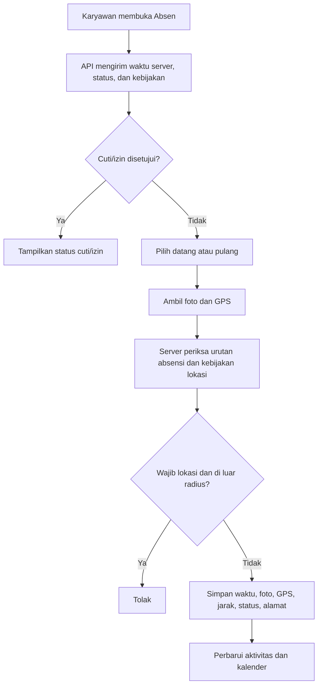

# Absensi Terintegrasi FSM — Implementasi Saat Ini

Dokumen ini diselaraskan dengan implementasi yang ada per 21 Agustus 2026, termasuk mobile, API, web admin, dan audit risiko.

## Cakupan

Absensi berada di aplikasi FSM yang sama.

Navigasi mobile: `Beranda` · `Absen` · `Keamanan` · `Kunci Layar`.

Web admin memiliki menu **Absensi** untuk mengelola lokasi, kebijakan karyawan, cuti/izin, dan rekap hari ini.

## Mobile

Halaman Absensi menggunakan shell visual Beranda: header IML/FSM Teknisi, band biru, panel tab putih overlap, serta bottom navigation yang sama.

Panel **Aktivitas Hari Ini** memuat dalam satu kartu:

- tanggal lengkap;
- jam `HH:MM:SS` berjalan;
- lokasi kerja dari master lokasi atau label lokasi fleksibel;
- penjelasan bahwa foto dan GPS wajib direkam.

Jam memakai `server_now` dari API lalu berjalan dengan pengukur durasi aplikasi. Mengubah jam perangkat setelah halaman dibuka tidak mengubah jam yang tampil.

Tindakan tersedia:

```text
[ Absen Datang ] [ Absen Pulang ]
[ Cuti / Izin ]
[ Kalender ]
```

Pulang baru aktif sesudah datang tercatat. Jika cuti/izin disetujui, tombol absensi digantikan status cuti/izin.

### Absen datang dan pulang

Setiap absensi meminta foto kamera, latitude, longitude, akurasi GPS, dan menggunakan waktu server sebagai waktu resmi.

| Data tersimpan | Datang | Pulang |
|---|---:|---:|
| Waktu server, foto, koordinat, akurasi | Ya | Ya |
| Jarak dan hasil validasi lokasi | Ya | Ya |
| Alamat hasil reverse geocoding | Ya | Ya |

Alamat diusahakan melalui OpenStreetMap Nominatim. Jika gagal, absensi tetap disimpan tanpa alamat.

Pada APK, mock location diperiksa sebelum absensi dikirim. Jika terdeteksi, aplikasi memblokir absen di sisi mobile.

### Kalender

Kalender menampilkan satu bulan, navigasi bulan sebelumnya/berikutnya, tombol refresh, dan **‹ Kembali**. Akhir pekan merah; titik hijau berarti lengkap, biru berarti cuti/izin disetujui, kuning berarti belum lengkap. Pergantian bulan memakai tanggal lokal dan tombol navigasi dikunci saat data dimuat.

### Cuti dan izin

| Jenis | Isian |
|---|---|
| Cuti | Tanggal mulai, tanggal selesai, catatan |
| Izin | Tanggal izin, jam mulai, jam selesai, catatan |

Pengajuan tidak meminta foto/lokasi. Status awal `pending`, lalu admin menyetujui atau menolak dengan catatan.

## Master lokasi dan kebijakan

Master lokasi menyimpan nama, alamat, latitude, longitude, radius default, dan status aktif/nonaktif.

| Mode | Perilaku |
|---|---|
| `required_location` | Ditolak jika berada di luar radius lokasi/override |
| `allowed_outside` | Diterima di luar radius dan ditandai `outside_allowed` |
| `anywhere` | Tidak membutuhkan lokasi acuan; foto/GPS tetap direkam |

Radius override karyawan dipakai bila terisi; selain itu radius master lokasi digunakan.

## Web admin

Menu **Absensi** menyediakan:

1. Tambah lokasi kerja: nama, alamat, GPS, radius.
2. Master lokasi: edit alamat, koordinat, radius, status.
3. Aturan per karyawan: lokasi, mode, radius khusus, dan pengaturan Fake GPS untuk tracking.
4. Approval cuti/izin pending.
5. Rekap absensi hari ini beserta foto, koordinat, alamat, dan detail peta.

## Alur



## Endpoint API

Semua endpoint memakai autentikasi Sanctum.

| Method | Endpoint | Fungsi |
|---|---|---|
| GET | `/api/v1/attendance/today` | Status hari ini, waktu server, kebijakan, absensi, cuti/izin |
| POST | `/api/v1/attendance/check-in` | Simpan datang: foto dan GPS |
| POST | `/api/v1/attendance/check-out` | Simpan pulang: foto dan GPS |
| GET | `/api/v1/attendance/calendar?month=YYYY-MM` | Riwayat satu bulan |
| POST | `/api/v1/leave-requests` | Kirim cuti/izin |

## Migrasi

Pastikan migrasi berikut telah dijalankan:

- `2026_08_13_000002_create_attendance_tables.php`
- `2026_08_13_000003_add_range_and_time_to_leave_requests_table.php`
- `2026_08_13_202905_add_address_columns_to_attendance_records_table.php`

```powershell
php artisan migrate
```

## Audit risiko / kemungkinan bug

Audit ini hanya mencatat temuan, belum mengubah perilaku aplikasi.

| Prioritas | Temuan | Dampak |
|---|---|---|
| P1 | Izin (`permission`) tidak mengisi `leave_end_date`, tetapi query menganggap nilai `NULL` tanpa akhir. | Izin yang disetujui berpotensi memblokir absensi pada tanggal-tanggal berikutnya. |
| P1 | Route dan `AttendanceAdminController` hanya memakai middleware `auth`, tanpa pemeriksaan peran admin/coordinator. | Pengguna dashboard yang tidak berwenang berpotensi mengubah lokasi, aturan, atau approval. |
| P1 | `is_active` lokasi belum diperiksa saat validasi absensi. | Lokasi nonaktif masih dapat menjadi acuan absensi. |
| P1 | Nominatim dipanggil sinkron tanpa timeout eksplisit atau cache. | Absensi bisa lambat ketika layanan eksternal bermasalah; koordinat juga dibagikan ke pihak ketiga. |
| P2 | Deteksi Fake GPS hanya di aplikasi mobile, bukan di server. | Klien/API yang dimodifikasi dapat mengirim koordinat palsu. |
| P2 | Akurasi GPS disimpan tetapi belum memiliki ambang penolakan/peringatan server. | Koordinat berakurasi rendah masih dapat lolos dalam radius. |
| P2 | Parameter `month` kalender belum divalidasi oleh request khusus. | Parameter tidak valid dapat menghasilkan error server, bukan respons validasi. |
| P3 | Belum ada pengecekan pengajuan cuti/izin yang tumpang tindih. | Admin dapat menerima beberapa pengajuan untuk periode sama. |

## Peningkatan berikutnya

1. Menutup temuan P1, terutama batas akhir izin dan otorisasi admin.
2. Menambahkan filter tanggal, ekspor rekap, dan notifikasi approval/pengingat pulang.
3. Menambahkan integrasi otomatis dengan penugasan FSM bila kebijakan lapangan diperlukan.
