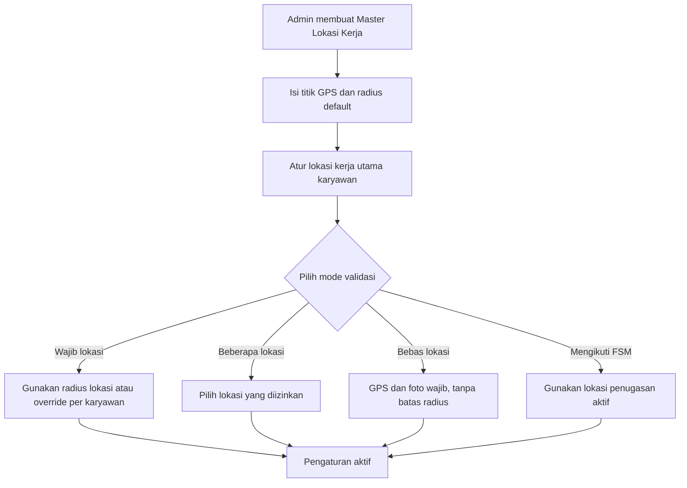
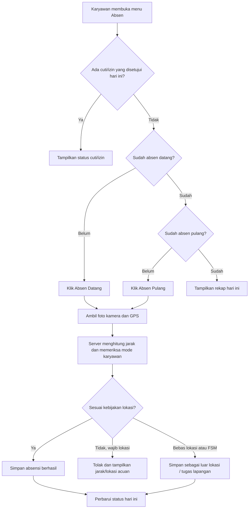
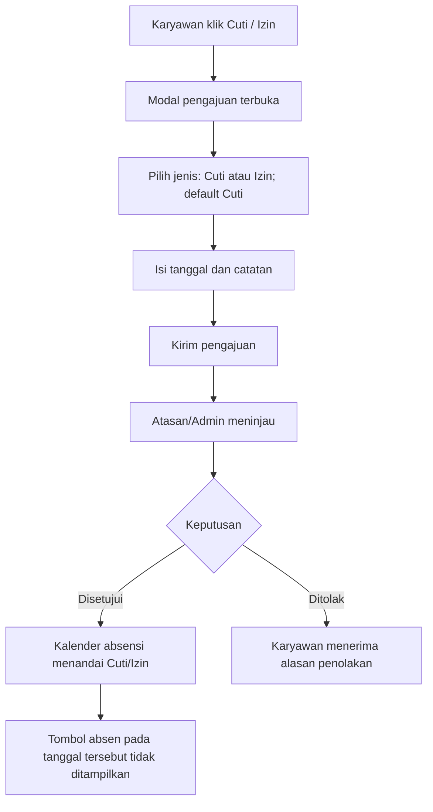

# Rancangan Absensi Terintegrasi FSM

## Ringkasan keputusan

Modul **Absensi** tetap berada dalam aplikasi FSM yang sama. Pada navigasi bawah, Absensi cukup menjadi satu menu utama; halaman di dalamnya memuat status hari ini dan mengarahkan pengguna ke riwayat serta cuti/izin. Dengan pendekatan ini aplikasi tetap ringkas, tetapi data absensi, penugasan lapangan, dan karyawan saling terhubung.

Dasar pengaturannya adalah **Master Lokasi Kerja**. Admin dapat membuat satu atau beberapa lokasi (kantor pusat, cabang, gudang, proyek), lalu menugaskan lokasi dan aturan absensi kepada tiap karyawan.

## Struktur menu aplikasi

Navigasi bawah yang digunakan saat ini:

`Beranda` · `Keamanan` · `Kunci Layar`

Absensi cukup ditambahkan sebagai satu menu baru, sehingga menjadi:

`Beranda` · `Absen` · `Keamanan` · `Kunci Layar`

Halaman **Absen** dibuat sederhana dan berfokus pada hari ini:

```text
[ Absen Datang ]  [ Absen Pulang ]
[ Cuti / Izin ]                         [ Kalender ]
------------------------------------------------------
Absensi hari ini
- Datang: 08:03
- Pulang: 17:12
```

Tombol datang/pulang hanya aktif sesuai statusnya. Detail foto, peta, dan GPS dapat dibuka dari tiap item absensi bila diperlukan, sehingga halaman utama tetap lega.

Jika karyawan memiliki cuti/izin yang telah disetujui untuk hari itu, blok absensi datang dan pulang tidak ditampilkan. Tampilan diganti menjadi:

```text
Sedang cuti
Catatan: Keperluan keluarga
```

## Kalender absensi

Satu tombol **Kalender** pada halaman Absen mengganti tampilan ke kalender penuh dari tanggal 1 sampai akhir bulan. Setiap tanggal diberi penanda warna agar cepat dipindai:

| Penanda | Arti |
|---|---|
| Hijau | Hadir lengkap (datang dan pulang) |
| Kuning | Absen belum lengkap / menunggu pulang |
| Biru | Cuti atau izin disetujui |
| Merah | Tidak ada absensi pada hari kerja |
| Abu-abu | Hari libur / akhir pekan |

Saat satu tanggal diklik, tampilkan detail absensi datang dan pulang (jam, foto, dan lokasi), atau status cuti/izin beserta catatannya. Dengan demikian kalender adalah riwayat visual, sementara halaman awal tetap hanya untuk aksi hari ini.

## Master Lokasi Kerja

Satu lokasi kerja menyimpan minimal:

| Data | Keterangan |
|---|---|
| Nama lokasi | Misalnya Kantor Pusat, Cabang Bandung, Proyek A |
| Alamat | Ditampilkan sebagai informasi untuk karyawan |
| Titik GPS | Latitude dan longitude sebagai pusat validasi |
| Radius default | Contoh 150 meter; dipakai untuk validasi lokasi |
| Status aktif | Lokasi nonaktif tidak bisa dipilih atau digunakan untuk absensi baru |

Radius sebaiknya diatur **per lokasi**, karena kondisi tiap tempat dapat berbeda. Contohnya kantor pusat 100 m, gudang 250 m, dan proyek 500 m.

## Pengaturan absensi per karyawan

Setiap karyawan memiliki lokasi kerja utama dan mode validasi. Ini memungkinkan Karyawan A ditetapkan ke Kantor B, sementara Karyawan C bekerja dari lokasi proyek.

| Mode | Lokasi & radius | Ketentuan |
|---|---|---|
| Wajib lokasi kerja | Menggunakan radius lokasi yang ditugaskan | Absen ditolak bila berada di luar radius |
| Bebas lokasi | Tidak dibatasi radius | Bisa absen dari mana saja; foto dan GPS tetap wajib |
| Beberapa lokasi | Memakai daftar lokasi yang diizinkan | Sah jika berada pada radius salah satu lokasi |
| Mengikuti penugasan FSM | Berdasarkan lokasi proyek/tugas aktif | Cocok untuk teknisi lapangan; lokasi tetap direkam |

Admin dapat memakai radius default dari lokasi atau memberi **override radius** khusus per karyawan bila diperlukan. Contoh: radius Kantor B 150 m, tetapi supervisor yang memakai area parkir luas dapat diberi radius 250 m.

Untuk mode bebas lokasi, sistem tidak mengabaikan bukti lokasi. Sistem tetap menyimpan koordinat, tingkat akurasi GPS, foto, waktu server, dan label **Luar lokasi kerja**. Ini membedakan kebijakan yang memang diizinkan dari absensi yang mencurigakan.

## Data yang direkam pada setiap absensi

- Karyawan dan tanggal kerja.
- Jenis absensi: datang atau pulang.
- Waktu dari server (bukan hanya waktu perangkat).
- Foto kamera.
- Latitude, longitude, dan akurasi GPS.
- Lokasi kerja yang menjadi acuan, hasil jarak ke titik lokasi, serta hasil validasi.
- Keterangan bila absen luar lokasi atau terkait tugas FSM.

## Flow pengaturan oleh admin



## Flow absen datang/pulang karyawan



## Flow cuti/izin



Isi modal pengajuan:

```text
Pengajuan Cuti / Izin

Jenis     : [ Cuti v ]
Tanggal   : [ pilih tanggal ]
Catatan   : [                         ]

                 [ Batal ] [ Kirim ]
```

Pengajuan **cuti/izin tidak memerlukan foto ataupun lokasi** secara default, karena proses ini adalah permohonan administratif, bukan peristiwa kehadiran. Sistem cukup mencatat waktu pengajuan dan pengguna yang mengajukan. Bila organisasi membutuhkan bukti sakit atau dokumen pendukung, tambahkan lampiran opsional (misalnya surat dokter), bukan foto selfie atau GPS.

Jika kelak ada kebijakan yang secara khusus mengharuskan lokasi saat pengajuan, pengaturan tersebut sebaiknya dibuat opt-in dan dijelaskan kepada karyawan. Namun rekomendasi awal adalah tidak merekamnya agar privasi tetap terjaga.

## Aturan penting yang disarankan

1. Kamera dan akses lokasi wajib diizinkan sebelum absensi dapat dikirim.
2. Tampilkan akurasi GPS; bila akurasinya terlalu rendah, minta pengguna mencoba kembali.
3. Gunakan waktu server sebagai waktu resmi absensi.
4. Foto dan koordinat hanya dipakai untuk bukti absensi, serta aksesnya dibatasi bagi peran yang berwenang.
5. Untuk kebutuhan operasional, admin tetap dapat melihat dan menindaklanjuti absensi luar lokasi, terlambat, atau belum pulang.

## Rekomendasi implementasi bertahap

**Tahap 1:** Master lokasi, pengaturan karyawan, absen datang/pulang dengan foto dan GPS, serta riwayat.

**Tahap 2:** Cuti/izin dan persetujuan admin/atasan.

**Tahap 3:** Integrasi penugasan FSM, laporan kehadiran, ekspor, dan notifikasi pengingat absen pulang.
