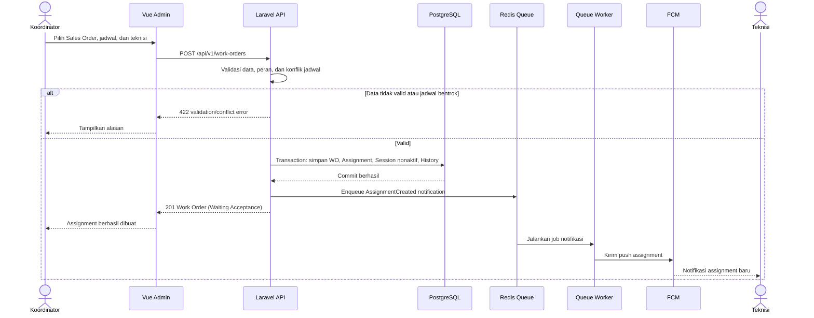
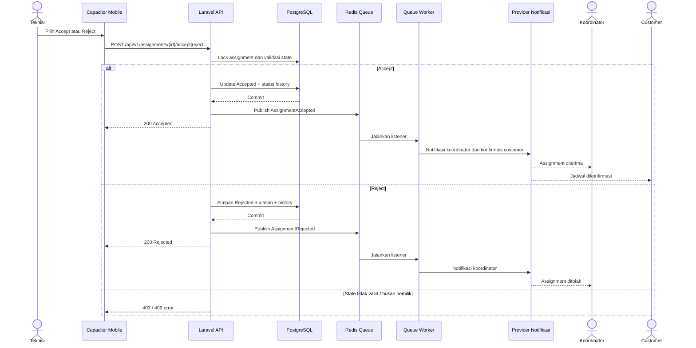

# Sequence Diagram

## Field Service Management (FSM) v1.0 — Live Tracking & Job Dispatch

**Versi:** 1.0 (draft)  
**Tujuan:** Menetapkan urutan komunikasi lintas komponen sebagai dasar endpoint API, event, queue, dan kontrak realtime.

---

## 1. Membuat dan Mengirim Assignment



## 2. Accept atau Reject Assignment



## 3. Start Trip dan GPS Realtime

```mermaid
sequenceDiagram
    actor T as Teknisi
    participant M as Capacitor Mobile
    participant API as Laravel API
    participant DB as PostgreSQL
    participant R as Redis
    participant RV as Laravel Reverb
    participant CP as Customer Portal
    participant VA as Vue Admin
    participant Q as Redis Queue
    participant W as Queue Worker

    T->>M: Start Trip
    M->>M: Pastikan izin GPS tersedia
    M->>API: POST /api/v1/work-orders/{id}/start-trip
    API->>DB: Validasi Accepted; aktifkan session; On The Way; history
    DB-->>API: Commit
    API->>Q: Publish TripStarted (kirim link customer)
    API-->>M: 200 Tracking Session aktif

    loop Selama On The Way dan koneksi tersedia
        M->>API: POST /api/v1/tracking/locations
        API->>API: Validasi token, pemilik assignment, dan sesi aktif
        API->>R: Simpan current location + TTL
        API->>RV: Broadcast TrackingLocationUpdated
        RV-->>CP: Lokasi dan status terbaru
        RV-->>VA: Lokasi dan status terbaru
        opt Interval persistensi terpenuhi
            API->>Q: Enqueue persist Tracking Point
            Q->>W: Jalankan persistensi
            W->>DB: Simpan Tracking Point
        end
        API-->>M: 202 Accepted
    end

    alt Koneksi mobile terputus
        M->>M: Simpan titik pada antrean offline
        M->>API: Kirim ulang saat koneksi pulih
    end
```

## 4. Arrived, Installation, dan Finish

```mermaid
sequenceDiagram
    actor T as Teknisi
    participant M as Capacitor Mobile
    participant API as Laravel API
    participant DB as PostgreSQL
    participant RV as Laravel Reverb
    participant CP as Customer Portal
    participant VA as Vue Admin
    participant Q as Redis Queue
    participant W as Queue Worker

    T->>M: Tekan Arrived
    M->>API: POST /api/v1/work-orders/{id}/arrived
    API->>DB: Validasi On The Way; status Arrived; history; nonaktifkan GPS
    DB-->>API: Commit
    API->>RV: Broadcast WorkOrderStatusChanged
    RV-->>CP: Teknisi sudah sampai
    RV-->>VA: Status Arrived
    API-->>M: 200 Arrived

    T->>M: Mulai pemasangan
    M->>API: POST /api/v1/work-orders/{id}/start-installation
    API->>DB: Status Installation + history
    DB-->>API: Commit
    API->>RV: Broadcast status
    API-->>M: 200 Installation

    T->>M: Finish
    M->>API: POST /api/v1/work-orders/{id}/finish
    API->>DB: Status Finished; history; tutup Tracking Session dan token
    DB-->>API: Commit
    API->>RV: Broadcast status akhir
    RV-->>CP: Pekerjaan selesai; akses tracking berakhir
    RV-->>VA: Status Finished
    API->>Q: Enqueue notifikasi/cleanup pasca pekerjaan
    API-->>M: 200 Finished
    Q->>W: Jalankan job lanjutan
```

## 5. Kontrak Interaksi yang Dikunci

| Area | Keputusan |
|---|---|
| Respons API | Aksi inti mengembalikan respons setelah transaksi database berhasil; tidak menunggu push/WA/email. |
| Konsistensi data | Update Work Order, Assignment/Session terkait, dan status history terjadi secara atomik. |
| Realtime | Redis menyimpan lokasi aktif; Reverb mendistribusikan pembaruan ke customer portal dan Vue admin yang diotorisasi. |
| Tracking offline | Mobile mengantrekan titik saat offline dan mencoba kembali saat koneksi pulih. |
| Data terminal | Finish/Cancel/Failed menutup Tracking Session dan mencabut akses token customer. |
| Idempotensi | Endpoint perubahan status dan tracking harus dilindungi terhadap pengiriman ulang akibat retry jaringan. |

## 6. Input Tahap Berikutnya

Sequence ini akan digunakan untuk merinci state diagram final dan kemudian mengidentifikasi tabel, relasi, indeks, event/outbox, serta endpoint pada desain ERD dan API.

