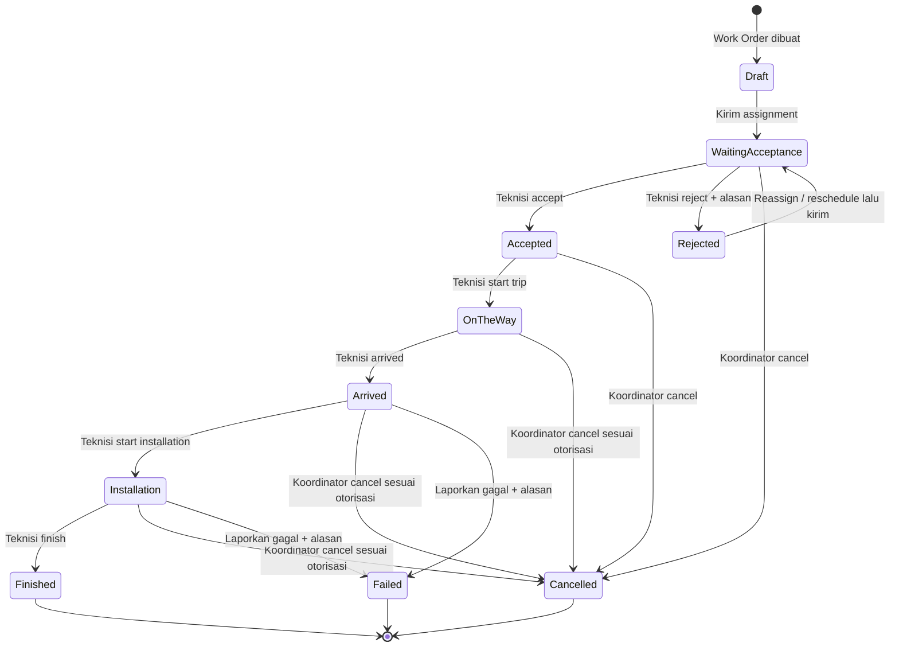

# State Diagram

## Field Service Management (FSM) v1.0 — Work Order Lifecycle

**Versi:** 1.0 (draft)  
**Tujuan:** Kontrak tunggal untuk status Work Order, transisi valid, pelaku, dan efek samping proses.

---

## 1. State Diagram

## 2. Definisi State

| State | Kategori | Definisi |
|---|---|---|
| `Draft` | Awal | Work Order sudah dibuat, tetapi belum dikirim kepada teknisi. |
| `Waiting Acceptance` | Aktif | Assignment telah dikirim dan menunggu respons teknisi. |
| `Accepted` | Aktif | Teknisi menyetujui Assignment dan siap memulai perjalanan. |
| `On The Way` | Aktif | Teknisi sedang menuju lokasi; Tracking Session aktif dan GPS dikirim. |
| `Arrived` | Aktif | Teknisi menyatakan sudah tiba; pengiriman GPS perjalanan dihentikan. |
| `Installation` | Aktif | Pekerjaan lapangan sedang dilakukan. |
| `Rejected` | Non-terminal | Teknisi menolak assignment; menunggu reassignment, reschedule, atau cancel. |
| `Finished` | Terminal | Pekerjaan selesai. |
| `Cancelled` | Terminal | Pekerjaan dibatalkan. |
| `Failed` | Terminal | Pekerjaan tidak dapat diselesaikan. |

## 3. Matriks Transisi

| Dari | Aksi | Ke | Pelaku | Prasyarat | Efek utama |
|---|---|---|---|---|---|
| `Draft` | Kirim assignment | `Waiting Acceptance` | Koordinator | Data lengkap; teknisi aktif; tidak bentrok | Buat Assignment, Tracking Session nonaktif, histori, dan notifikasi. |
| `Waiting Acceptance` | Accept | `Accepted` | Teknisi assigned | Assignment miliknya dan masih aktif | Histori; notifikasi koordinator/customer. |
| `Waiting Acceptance` | Reject | `Rejected` | Teknisi assigned | Alasan wajib diisi | Histori; notifikasi koordinator. |
| `Rejected` | Reassign / reschedule lalu kirim | `Waiting Acceptance` | Koordinator | Teknisi/jadwal pengganti valid | Assignment baru/rekam perubahan; notifikasi. |
| `Accepted` | Start Trip | `On The Way` | Teknisi assigned | Izin GPS tersedia dan sesi valid | Aktifkan tracking, histori, kirim link customer. |
| `On The Way` | Arrived | `Arrived` | Teknisi assigned | Sesi tracking aktif | Hentikan GPS aktif, histori, broadcast status. |
| `Arrived` | Start Installation | `Installation` | Teknisi assigned | Work Order miliknya | Histori dan broadcast status. |
| `Installation` | Finish | `Finished` | Teknisi assigned | Work Order miliknya | Tutup sesi/token, histori, broadcast/notifikasi akhir. |
| State non-terminal | Cancel | `Cancelled` | Koordinator / aktor berwenang | Alasan wajib; otorisasi valid | Tutup sesi/token bila ada, histori, broadcast/notifikasi. |
| `Arrived` atau `Installation` | Report Failed | `Failed` | Teknisi assigned / Koordinator | Alasan wajib | Tutup sesi/token, histori, broadcast/notifikasi. |

## 4. Aturan Invarian

- Hanya Work Order berstatus `On The Way` yang boleh memiliki Tracking Session aktif dan menerima lokasi GPS.
- Status terminal (`Finished`, `Cancelled`, `Failed`) tidak dapat berubah melalui transisi normal.
- Setiap transisi harus divalidasi di backend, terjadi dalam transaksi database, dan membuat `Work Order Status History`.
- Setiap aksi oleh teknisi harus memverifikasi bahwa assignment aktif adalah milik teknisi tersebut.
- Aksi `Reject`, `Cancel`, dan `Report Failed` wajib menyimpan alasan.
- Semua transisi harus aman terhadap retry request (idempotent atau menolak duplicate transition secara jelas).
- `Rejected` tidak dianggap terminal karena Work Order dapat ditugaskan ulang atau dijadwalkan ulang tanpa kehilangan jejak sebelumnya.

## 5. Aturan UI Berdasarkan Status

| Status | Aksi utama yang tampil pada aplikasi teknisi |
|---|---|
| `Waiting Acceptance` | Accept, Reject |
| `Accepted` | Start Trip |
| `On The Way` | Arrived |
| `Arrived` | Start Installation, Report Failed |
| `Installation` | Finish, Report Failed |
| Terminal / bukan assignment aktif | Tidak ada aksi status normal |

## 6. Input ERD

State machine ini menegaskan kebutuhan tabel/konsep berikut untuk desain database: Work Order sebagai pemilik status aktif, Work Order Status History sebagai audit transisi, Assignment sebagai jejak dispatch, Tracking Session sebagai lifecycle GPS, serta Tracking Token untuk akses customer yang tertutup saat terminal state.

