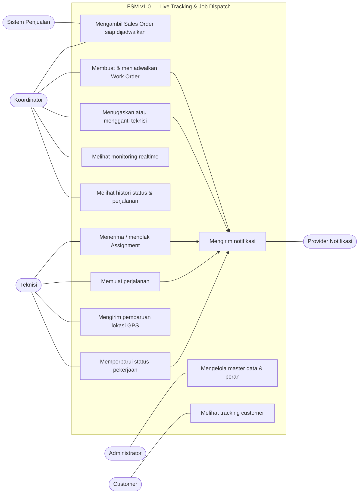

# Use Case Diagram

## Field Service Management (FSM) v1.0 — Live Tracking & Job Dispatch

**Versi:** 1.0 (draft)  
**Dasar:** BRD, Domain Model, Functional Requirements, dan NFR FSM v1.0

---

## 1. Aktor

| Aktor | Deskripsi |
|---|---|
| Administrator | Mengelola akun, peran, serta master data sistem. |
| Koordinator | Membuat Work Order, menjadwalkan dan menugaskan teknisi, serta memonitor operasi. |
| Teknisi | Menerima pekerjaan, memperbarui status, dan mengirim lokasi saat perjalanan. |
| Customer | Melihat status dan lokasi teknisi melalui tautan tracking terbatas. |
| Sistem Penjualan | Menyediakan Sales Order dan data referensi untuk Work Order. |
| Provider Notifikasi | Mengirim push notification, WhatsApp, atau email atas permintaan FSM. |

## 2. Diagram Use Case Utama

## 3. Daftar Use Case

| ID | Use case | Aktor utama | Ringkasan |
|---|---|---|---|
| UC-001 | Lihat Sales Order siap dijadwalkan | Koordinator | Menampilkan transaksi dari sistem penjualan yang memenuhi syarat menjadi Work Order. |
| UC-002 | Buat dan jadwalkan Work Order | Koordinator | Membuat Work Order, menentukan jadwal, lokasi, catatan, dan data pekerjaan. |
| UC-003 | Assign / reassign teknisi | Koordinator | Menetapkan teknisi utama, memvalidasi bentrok, lalu mengirim assignment. |
| UC-004 | Terima assignment | Teknisi | Menyetujui tugas yang ditugaskan kepadanya. |
| UC-005 | Tolak assignment | Teknisi | Menolak tugas dengan alasan; sistem memberi tahu koordinator. |
| UC-006 | Mulai perjalanan | Teknisi | Mengubah Work Order ke `On The Way`, mengaktifkan Tracking Session, dan memulai GPS. |
| UC-007 | Kirim lokasi GPS | Teknisi | Mengirim lokasi saat Tracking Session aktif. |
| UC-008 | Tandai tiba | Teknisi | Mengubah status menjadi `Arrived` dan menghentikan pengiriman GPS aktif. |
| UC-009 | Mulai pemasangan | Teknisi | Mengubah status dari `Arrived` ke `Installation`. |
| UC-010 | Selesaikan pekerjaan | Teknisi | Mengubah status menjadi `Finished` dan menutup tracking session. |
| UC-011 | Batalkan / laporkan gagal | Koordinator, Teknisi sesuai otorisasi | Menutup Work Order dengan alasan sebagai `Cancelled` atau `Failed`. |
| UC-012 | Lihat monitoring realtime | Koordinator | Melihat daftar Work Order, status, dan posisi teknisi yang sedang perjalanan. |
| UC-013 | Lihat tracking customer | Customer | Melihat status dan posisi teknisi melalui token tracking yang masih berlaku. |
| UC-014 | Lihat histori pekerjaan | Koordinator | Meninjau histori status, assignment, dan titik perjalanan yang diizinkan. |
| UC-015 | Kelola master data | Administrator | Mengelola akun/peran dan data teknisi; area/kendaraan dapat ditambahkan bertahap. |

## 4. Relasi Use Case Penting

| Use case utama | Relasi |
|---|---|
| UC-002 Buat dan jadwalkan Work Order | Menggunakan UC-001 untuk mengambil konteks Sales Order. |
| UC-003 Assign / reassign teknisi | Memicu notifikasi assignment; dapat dilakukan ulang setelah UC-005 atau perubahan jadwal. |
| UC-004 Terima assignment | Memicu notifikasi koordinator dan konfirmasi customer. |
| UC-006 Mulai perjalanan | Mengaktifkan UC-007 dan memicu penyediaan tautan UC-013. |
| UC-008 Tandai tiba | Mengakhiri pengiriman aktif pada UC-007, lalu memungkinkan UC-009. |
| UC-010 Selesaikan pekerjaan | Menutup Tracking Session dan menonaktifkan akses UC-013. |

## 5. Batasan Akses

- Customer tidak memiliki akses akun internal dan hanya dapat memakai tautan tracking yang masih aktif.
- Teknisi tidak dapat melihat Work Order maupun mengirim lokasi untuk assignment teknisi lain.
- Koordinator dapat melihat histori dan monitoring sesuai ruang operasionalnya.
- Administrator tidak berarti dapat mengabaikan audit; semua tindakan penting tetap dicatat.

## 6. Input Tahap Berikutnya

Use case yang paling kritis untuk dirinci sebagai Activity Diagram dan Sequence Diagram adalah:

1. UC-003 — Assign / reassign teknisi.
2. UC-004 dan UC-005 — Accept / reject assignment.
3. UC-006 dan UC-007 — Start trip dan GPS update.
4. UC-008 sampai UC-010 — Arrived, installation, dan finish.
5. UC-013 — Customer tracking portal.

